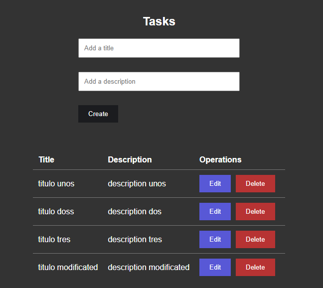

# Nodejs Prisma ORM and React Vite 
<p align="justify">
Nodejs Prisma ORM REST API with sqlite  where you create title and description for the backend and React with vite in the fronted.
</p>



Remember cosider
```js
npm install cors
```
```js
// Habilite CORS for all the routes
app.use(cors());
```


