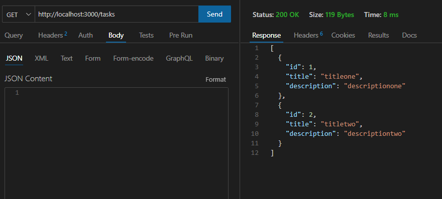
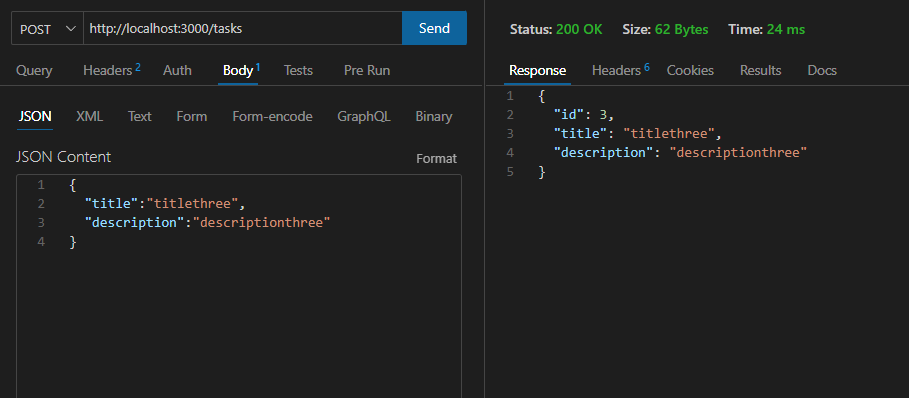
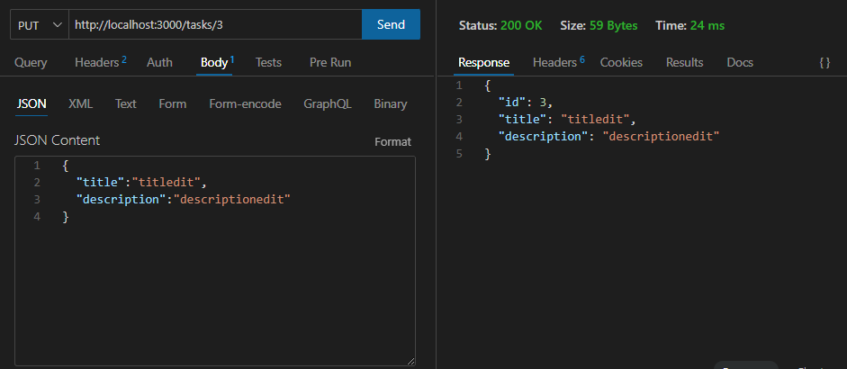
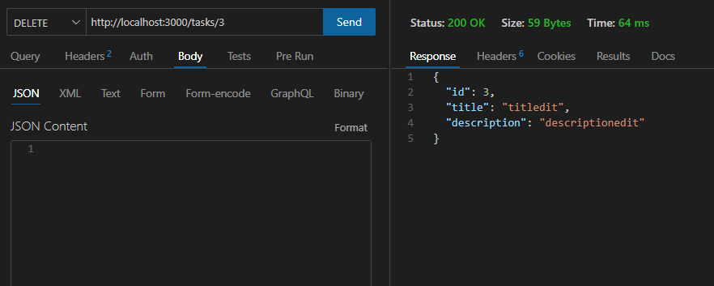

# Prisma ORM REST API create Tasks

<p align="justify">
Nodejs Prisma ORM RESTAPI where you create title and description in sqlite. 
</p>

GET
<p align="center">
  
</p>

POST
<p align="center">
  
</p>

PUT
<p align="center">
  
</p>

DELETE
<p align="center">
  
</p>


## Steps to implement it
Execute 
```python
npm install
npm run dev
```

---

### Starting from scratch :

```python
npm init -y
npm install prisma --save-dev
npx prisma init
npm install express 
npm i nodemon -D
```
---
##### After of model created:

```python
model Task {
  id Int @id @default(autoincrement())
  title  String 
  description String
}
```

```python
npx prisma migrate dev
```

